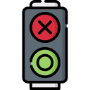

[](.media/logo.png?raw=true "TrafficLight logo")

# TrafficLight

<p>
<a href="https://github.com/mupfelofen-de/TrafficLight">
  
</a>
<a href="https://github.com/mupfelofen-de/BluePrint/blob/master/LICENCE.md">
  
</a>
<a href="https://travis-ci.org/mupfelofen-de/TrafficLight">
  
</a>
</p>

## About

A bobby car raceway traffic light control for our local day care centre.

This project is built upon
[BluePrint](https://github.com/mupfelofen-de/BluePrint), a base project
for the STM32F103C8T6 aka [blue pill board](http://reblag.dk/stm32/).

## Schematic

Todo.

## Installation

1. Install [PlatformIO Core](http://docs.platformio.org/page/core.html)
2. Run these commands:

```bash
    # Build project
    > platformio run

    # Upload firmware
    > platformio run --target upload

    # Clean build files (optional)
    > platformio run --target clean
```

## Licence

The source code of this software is licenced, unless stated otherwise,
under the terms of [The Beerware Licence](LICENCE.md).

Logo icon made by [Freepik](https://www.flaticon.com/authors/freepik)
from [Flaticon](https://www.flaticon.com/).
